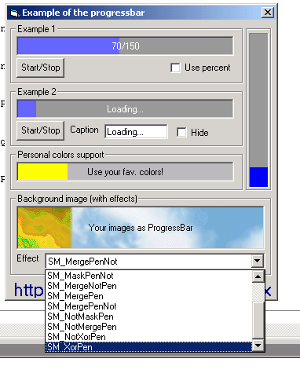



## SebaMix ProgressBar

### Description

Little dll that allow you to transform a picture box to a progressbar. Using it is really simple and give you lot of effects (see screenshot), just see the read-me file inside the zip.

Enjoy it!
 
### More Info
 

             |
---                |---
**Submitted On**   |2002-02-07 20:45:18
**By**             |[Sebastiano Pallaro](https://github.com/Planet-Source-Code/PSCIndex/blob/master/ByAuthor/sebastiano-pallaro.md)
**Level**          |Intermediate
**User Rating**    |4.9 (34 globes from 7 users)
**Compatibility**  |VB 5\.0, VB 6\.0
**Category**       |[Custom Controls/ Forms/  Menus](https://github.com/Planet-Source-Code/PSCIndex/blob/master/ByCategory/custom-controls-forms-menus__1-4.md)
**World**          |[Visual Basic](https://github.com/Planet-Source-Code/PSCIndex/blob/master/ByWorld/visual-basic.md)
**Archive File**   |[SebaMix\_Pr53742272002\.zip](https://github.com/Planet-Source-Code/sebastiano-pallaro-sebamix-progressbar__1-31584/archive/master.zip)

